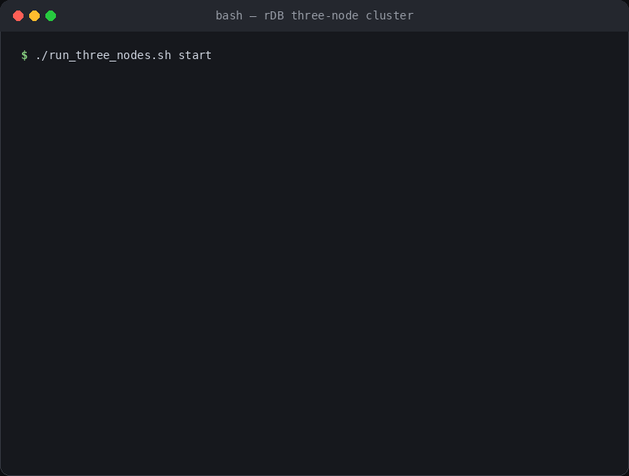
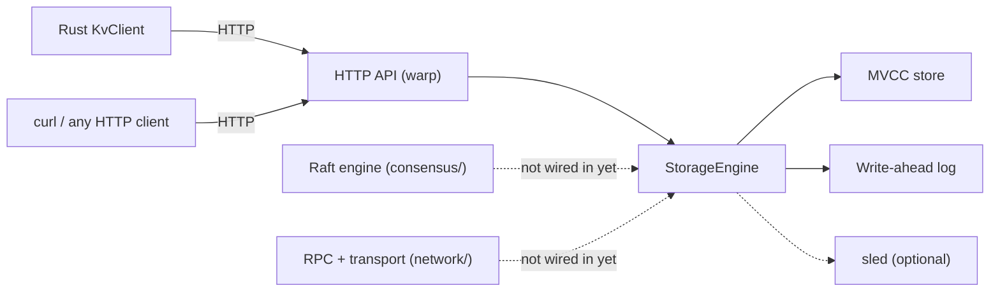
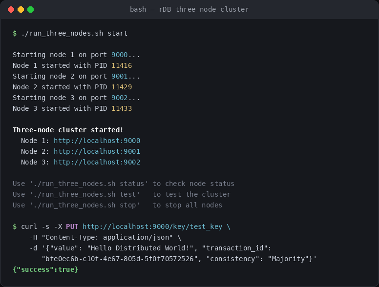
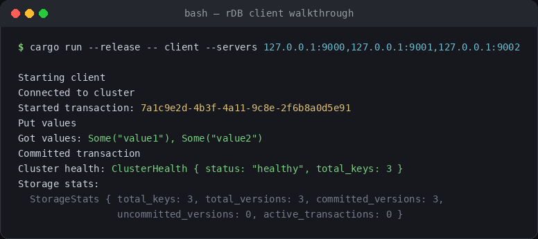

# rDB

**A transactional, MVCC key-value store in Rust with a Raft consensus engine taking shape underneath it.**


rDB is basically a from-scratch key-value store built to explore how real databases work under the
hood: with multi-version concurrency control, write-ahead logging, transactions, and Raft-based 
replication across a cluster. Today, the single-node storage engine and its HTTP API are 
fully functional. The consensus and networking layers that will turn
multiple nodes into one replicated cluster are in the codebase and taking shape, but not
wired into the running server yet: please see [Status](#status--roadmap) for exactly where the
line is.

## Demo
A super quick run through of starting the client + a small walkthrough



## What's implemented

- **MVCC storage engine**: every write creates a new version; a transaction's reads see
  a consistent snapshot as of when it began; write–write conflicts are detected and
  rejected. (`src/storage/mvcc.rs`)
- **Write-ahead log**: every put, delete, commit, and abort is appended to a
  length-prefixed, `bincode`-encoded log before it's applied, and replayed on startup to
  rebuild state. (`src/storage/wal.rs`)
- **Transactions**: begin → read/write → commit or abort, exposed over HTTP and through
  the Rust client.
- **HTTP REST API**: JSON in, JSON out, built on `warp`. (`src/api/http.rs`)
- **Rust client SDK**: `KvClient` fails over across a list of servers and decodes
  responses into plain `String`s for you. (`src/client/client.rs`)
- **Single binary CLI** — run a `server` node or the bundled demo `client`.
- **Optional durable storage** — an embedded `sled` database can back the engine so data
  survives a restart, alongside the WAL.

## Architecture



Solid arrows are live today. Dashed arrows are the replication path that's scaffolded in
`src/consensus/` and `src/network/` but not yet connected to `StorageEngine` — running
several nodes right now means several independent stores, each with its own WAL and data
directory, not a replicated cluster.

## Quickstart

### Build

```bash
cargo build --release
```

### Run a single node

```bash
cargo run --release -- server --node-id 1 --http-port 9000
```

### Run three nodes side by side

Each gets its own WAL and data directory (`./wal_node_<id>`, `./data_node_<id>`), so this
is safe to run from the same checkout in separate terminals (or backgrounded, as below):

```bash
cargo run --release -- server --node-id 1 --http-port 9000 &
cargo run --release -- server --node-id 2 --http-port 9001 &
cargo run --release -- server --node-id 3 --http-port 9002 &
```



### Talk to it with curl

```bash
# Begin a transaction
TXN=$(curl -s -X POST http://localhost:9000/transaction/begin | jq -r .transaction_id)

# Write a key
curl -s -X PUT http://localhost:9000/key/hello \
  -H "Content-Type: application/json" \
  -d "{\"value\": \"world\", \"transaction_id\": \"$TXN\", \"consistency\": \"Majority\"}"

# Commit
curl -s -X POST http://localhost:9000/transaction/commit \
  -H "Content-Type: application/json" \
  -d "{\"transaction_id\": \"$TXN\"}"

# Read it back
curl -s "http://localhost:9000/key/hello?transaction_id=$TXN&consistency=Strong"
```

### Or use the bundled demo client

`cargo run -- client` runs a small scripted walkthrough — begin a transaction, put two
keys, read them back, commit, then print cluster health and storage stats:

```bash
cargo run --release -- client --servers 127.0.0.1:9000,127.0.0.1:9001,127.0.0.1:9002
```



## HTTP API

| Method | Path                  | Body / query                                          | Notes                                   |
|--------|------------------------|--------------------------------------------------------|------------------------------------------|
| GET    | `/health`              | —                                                      | `{ "status", "total_keys" }`             |
| GET    | `/stats`               | —                                                      | MVCC/version counters, see below         |
| POST   | `/transaction/begin`   | —                                                      | `{ "transaction_id", "success" }`        |
| POST   | `/transaction/commit`  | `{ "transaction_id" }`                                 | `{ "success" }`                          |
| GET    | `/key/{key}`           | `?transaction_id=...&consistency=Eventual\|Majority\|Strong` | consistency defaults to `Eventual`  |
| PUT    | `/key/{key}`           | `{ "value", "transaction_id", "consistency"? }`        | consistency defaults to `Majority`, options: `Any\|Majority\|All` |
| DELETE | `/key/{key}`           | `?transaction_id=...&consistency=Any\|Majority\|All`  | consistency defaults to `Majority`       |

`GET /stats` returns:

```json
{
  "total_keys": 3,
  "total_versions": 3,
  "committed_versions": 3,
  "uncommitted_versions": 0,
  "active_transactions": 0
}
```

## Using it as a library

```rust
use distributed_kv_store::client::KvClient;
use distributed_kv_store::core::WriteConsistency;

#[tokio::main]
async fn main() -> Result<(), Box<dyn std::error::Error>> {
    let client = KvClient::new(vec!["127.0.0.1:9000".into()]);
    client.connect().await?;

    let tx = client.begin_transaction().await?;
    client.put("key1", "value1", tx, Some(WriteConsistency::Majority)).await?;
    let value = client.get("key1", tx, None).await?;
    client.commit(tx).await?;

    println!("{:?}", value); // Some("value1")
    Ok(())
}
```

## Tech stack

`tokio` (async runtime) · `warp` + `hyper` (HTTP API) · `reqwest` (client) · `sled`
(optional persistence) · `serde` / `serde_json` / `bincode` (serialization) · `uuid`,
`chrono` (ids and timestamps) · `dashmap`, `parking_lot`, `crossbeam` (concurrency) ·
`clap` (CLI) · `tracing` (logging) · `tonic` / `prost` (reserved for a future gRPC
transport) · `anyhow` / `thiserror` (errors)

## License

No license file is included yet. Until one is added, the usual GitHub default terms
apply (all rights reserved) — add an `MIT` or `Apache-2.0` `LICENSE` file before treating
this as open for reuse.
